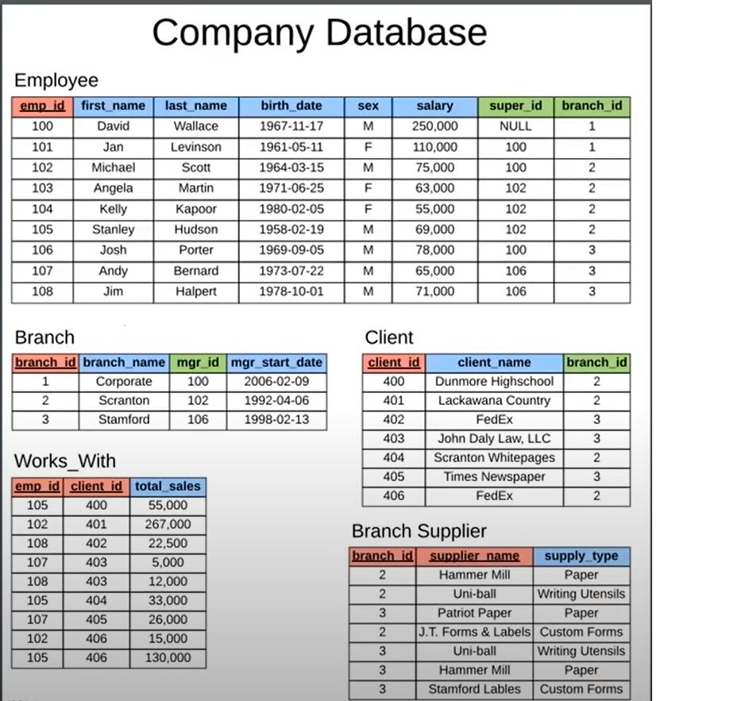

<details>
<summary></strong>Schema</strong></summary>

</details>
<br>

<details>
<summary></strong>Definition</strong></summary>
<br>

## Create employee table

```sql
CREATE TABLE employee (
    emp_id INT PRIMARY KEY,
    first_name VARCHAR(40),
    last_name VARCHAR(40),
    birth_day DATE,
    sex VARCHAR(1),
    salary INT,
    super_id INT,
    branch_id INT
);
```

## Create branch table
```sql
CREATE TABLE branch (
    branch_id INT PRIMARY KEY,
    branch_name VARCHAR(40),
    mgr_id INT,
    mgr_start_date DATE,
    FOREIGN KEY(mgr_id) REFERENCES employee(emp_id) ON DELETE SET NULL
);
```

### Add foreign key of branch in emoloyee table
```sql
ALTER TABLE employee
ADD FOREIGN KEY(branch_id)
REFERENCES branch(branch_id)
ON DELETE SET NULL;
```

### Add foreign key of super id in emoloyee table
```sql
ALTER TABLE employee
ADD FOREIGN KEY (super_id)
REFERENCES employee(emp_id)
ON DELETE SET NULL;
```

### Create client table
```sql
CREATE TABLE client (
    client_id INT PRIMARY KEY,
    client_name VARCHAR(40),
    branch_id INT,
    FOREIGN KEY(branch_id) REFERENCES branch(branch_id) ON DELETE SET NULL
);
```

### Create works with table
```sql
CREATE TABLE works_with (
    emp_id INT,
    client_id INT,
    total_sales INT,
    PRIMARY KEY(emp_id, client_id),
    FOREIGN KEY(emp_id) REFERENCES employee(emp_id) ON DELETE CASCADE,
    FOREIGN KEY(client_id) REFERENCES client(client_id) ON DELETE CASCADE
);
```

### Create branch supplier table
```sql
CREATE TABLE branch_supplier (
    branch_id INT,
    supplier_name VARCHAR(40),
    supply_type VARCHAR(40),
    PRIMARY KEY(branch_id, supplier_name),
    FOREIGN KEY(branch_id) REFERENCES branch(branch_id) ON DELETE CASCADE
);
```

</details>
<br>


<details>
<summary></strong>Manipulation</strong></summary>

```sql
-- Corporate
INSERT INTO employee VALUES(100, 'David', 'Wallace', '1967-11-17', 'M', 250000, NULL, NULL);
INSERT INTO branch VALUES(1, 'Corporate', 100, '2006-02-09');

UPDATE employee
SET branch_id = 1
WHERE emp_id = 100;

INSERT INTO employee VALUES(101, 'Jan', 'Levinson', '1961-05-11', 'F', 110000, 100, 1);

-- Scranton
INSERT INTO employee VALUES(102, 'Michael', 'Scott', '1964-03-15', 'M', 75000, 100, NULL);

INSERT INTO branch VALUES(2, 'Scranton', 102, '1992-04-06');

UPDATE employee
SET branch_id = 2
WHERE emp_id = 102;

INSERT INTO employee VALUES(103, 'Angela', 'Martin', '1971-06-25', 'F', 63000, 102, 2);
INSERT INTO employee VALUES(104, 'Kelly', 'Kapoor', '1980-02-05', 'F', 55000, 102, 2);
INSERT INTO employee VALUES(105, 'Stanley', 'Hudson', '1958-02-19', 'M', 69000, 102, 2);

-- Stamford
INSERT INTO employee VALUES(106, 'Josh', 'Porter', '1969-09-05', 'M', 78000, 100, NULL);
INSERT INTO branch VALUES(3, 'Stamford', 106, '1998-02-13');

UPDATE employee
SET branch_id = 3
WHERE emp_id = 106;

INSERT INTO employee VALUES(107, 'Andy', 'Bernard', '1973-07-22', 'M', 65000, 106, 3);
INSERT INTO employee VALUES(108, 'Jim', 'Halpert', '1978-10-01', 'M', 71000, 106, 3);

-- BRANCH SUPPLIER
INSERT INTO branch_supplier VALUES(2, 'Hammer Mill', 'Paper');
INSERT INTO branch_supplier VALUES(2, 'Uni-ball', 'Writing Utensils');
INSERT INTO branch_supplier VALUES(3, 'Patriot Paper', 'Paper');
INSERT INTO branch_supplier VALUES(2, 'J.T. Forms & Labels', 'Custom Forms');
INSERT INTO branch_supplier VALUES(3, 'Uni-ball', 'Writing Utensils');
INSERT INTO branch_supplier VALUES(3, 'Hammer Mill', 'Paper');
INSERT INTO branch_supplier VALUES(3, 'Stamford Lables', 'Custom Forms');

-- CLIENT
INSERT INTO client VALUES(400, 'Dunmore Highschool', 2);
INSERT INTO client VALUES(401, 'Lackawana Country', 2);
INSERT INTO client VALUES(402, 'FedEx', 3);
INSERT INTO client VALUES(403, 'John Daly Law, LLC', 3);
INSERT INTO client VALUES(404, 'Scranton Whitepages', 2);
INSERT INTO client VALUES(405, 'Times Newspaper', 3);
INSERT INTO client VALUES(406, 'FedEx', 2);

-- WORKS_WITH
INSERT INTO works_with VALUES(105, 400, 55000);
INSERT INTO works_with VALUES(102, 401, 267000);
INSERT INTO works_with VALUES(108, 402, 22500);
INSERT INTO works_with VALUES(107, 403, 5000);
INSERT INTO works_with VALUES(108, 403, 12000);
INSERT INTO works_with VALUES(105, 404, 33000);
INSERT INTO works_with VALUES(107, 405, 26000);
INSERT INTO works_with VALUES(102, 406, 15000);
INSERT INTO works_with VALUES(105, 406, 130000);
```

</details>
<br>

<details>
<summary></strong>Query</strong></summary>


## Show employess

### Basic SELECT queries
```sql
SELECT * FROM employee;
```
```bash
OUTPUT
+--------+------------+-----------+------------+------+--------+----------+-----------+
| emp_id | first_name | last_name | birth_day  | sex  | salary | super_id | branch_id |
+--------+------------+-----------+------------+------+--------+----------+-----------+
|    100 | David      | Wallace   | 1967-11-17 | M    | 250000 |     NULL |         1 |
|    101 | Jan        | Levinson  | 1961-05-11 | F    | 110000 |      100 |         1 |
|    102 | Michael    | Scott     | 1964-03-15 | M    |  75000 |      100 |         2 |
|    103 | Angela     | Martin    | 1971-06-25 | F    |  63000 |      102 |         2 |
|    104 | Kelly      | Kapoor    | 1980-02-05 | F    |  55000 |      102 |         2 |
|    105 | Stanley    | Hudson    | 1958-02-19 | M    |  69000 |      102 |         2 |
|    106 | Josh       | Porter    | 1969-09-05 | M    |  78000 |      100 |         3 |
|    107 | Andy       | Bernard   | 1973-07-22 | M    |  65000 |      106 |         3 |
|    108 | Jim        | Halpert   | 1978-10-01 | M    |  71000 |      106 |         3 |
+--------+------------+-----------+------------+------+--------+----------+-----------+
```
```sql
SELECT * FROM employee;
SELECT * FROM employee ORDER BY salary DESC;
SELECT first_name as f, last_name as l FROM employee ORDER BY f, l;
```

### Distinct
```sql
SELECT DISTINCT sex FROM employee;
```
```bash
OUTPUT -
+------+
| sex  |
+------+
| M    |
| F    |
+------+
```

### Aggregation commands
```sql
SELECT COUNT(super_id) FROM employee;
SELECT COUNT(emp_id) FROM employee WHERE sex = 'F' AND birth_day > '1970-01-01';
SELECT AVG(SALARY) FROM employee;
SELECT SUM(SALARY) FROM employee;
```

### Find out male and female count
```sql
SELECT COUNT(sex), sex FROM employee GROUP BY sex;
```
```bash
OUTPUT -
+------------+------+
| COUNT(sex) | sex  |
+------------+------+
|          6 | M    |
|          3 | F    |
+------------+------+
```

### Find total sales of each salesman
```sql
SELECT SUM(total_sales), emp_id
FROM works_with
GROUP BY emp_id;
```
```bash
OUTPUT -
+------------------+--------+
| SUM(total_sales) | emp_id |
+------------------+--------+
|           282000 |    102 |
|           218000 |    105 |
|            31000 |    107 |
|            34500 |    108 |
+------------------+--------+
```

### Find total sales of each sales man with first name and last name
```sql
SELECT SUM(works_with.total_sales) AS sum_total_sales, works_with.emp_id, CONCAT(employee.first_name, ' ', employee.last_name) AS name
FROM works_with
INNER JOIN employee
ON works_with.emp_id = employee.emp_id
GROUP BY works_with.emp_id;
```
```bash
OUTPUT -
+-----------------+--------+----------------+
| sum_total_sales | emp_id | name           |
+-----------------+--------+----------------+
|          282000 |    102 | Michael Scott  |
|          218000 |    105 | Stanley Hudson |
|           31000 |    107 | Andy Bernard   |
|           34500 |    108 | Jim Halpert    |
+-----------------+--------+----------------+
```

</details>
<br>

